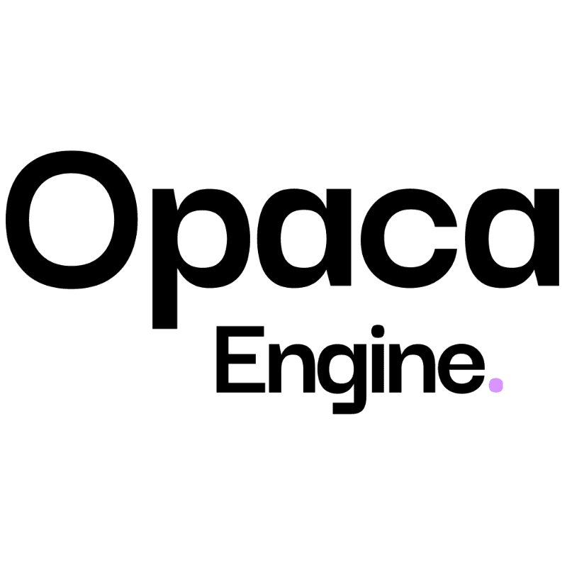

# Opaca Engine

<p align="center">
  
</p>

Opaca Engine is an open-source, production-ready clone of Incogni / DeleteMe. It automates the extraction and deletion of Personal Identifiable Information (PII) from the internet's largest and most opaque data brokers.

## 🚀 Features

- **Automated Broker Scrubbing:** Connects identity matrices to BullMQ worker daemons running headless Playwright browsers to automate CCPA/GDPR compliance forms.
- **Subscription Billing:** Natively integrated with Stripe Checkout and Stripe Webhooks to gate workflows behind active recurring subscriptions.
- **Data Profiles (Identities):** Highly encrypted backend schemas cleanly associate real-world targets (names, ghost emails, fake phones) to orchestrated broker dispatches.
- **Monorepo Architecture:** Seamlessly isolated frontend React Client and backend Express/Prisma Server using NPM Workspaces.
- **Cron Daemons:** Runs resilient daily background sweeps automatically bridging expired API requests to broker portals.
- **Role-Based Access (RBAC):** Gated `/admin` dashboards isolating broker configuration logic from standard user portals.

## 🛠 Tech Stack

- **Frontend:** React 18, Vite, Tailwind CSS, Lucide Icons, React Router
- **Backend:** Node.js, Express, Prisma ORM (Postgres), Zod
- **Automation Engine:** BullMQ (Redis), Playwright (Chromium)
- **Email Infrastructure:** Nodemailer (SMTP Webhook parsing)
- **Containerization:** Docker Compose (Bridge Networking)

---

## ⚡ Quick Start (Development)

Ensure you have Docker and NodeJS (>= 20.x) installed locally.

**1. Clone the Monorepo**
```bash
git clone https://github.com/your-org/opaca-engine.git
cd opaca-engine
npm install
```

**2. Configure Environment Variables**
Copy the default environment template and populate it with your local configurations (or Stripe secrets).
```bash
cp .env.example .env
```

**3. Launch the Stack**
Opaca Engine uses Docker Compose to orchestrate Postgres, Redis, the Express Server, and the Vite Frontend locally.
```bash
docker-compose up --build
```
*Wait for Prisma to generate clients and seed the database.*

**4. Accessing the Platform**
- **Public React UI:** [http://localhost:5173/login](http://localhost:5173/login)
- **Admin Dashboard:** Access via the seeded root account `admin@opaca.local` / `Admin123!` at [http://localhost:5173/admin](http://localhost:5173/admin)
- **API Swagger Docs:** [http://localhost:4000/api/docs](http://localhost:4000/api/docs)

---

## 📖 Extended Documentation
For a deep dive into the underlying architecture, data privacy mechanics, or adding new Playwright broker form-fills, please refer to the documents below:

- [System Architecture (ARCHITECTURE.md)](docs/ARCHITECTURE.md)
- [Broker Integration Guidelines](docs/BROKERS.md)
- [Stripe Monetization Setup](docs/BILLING.md)
