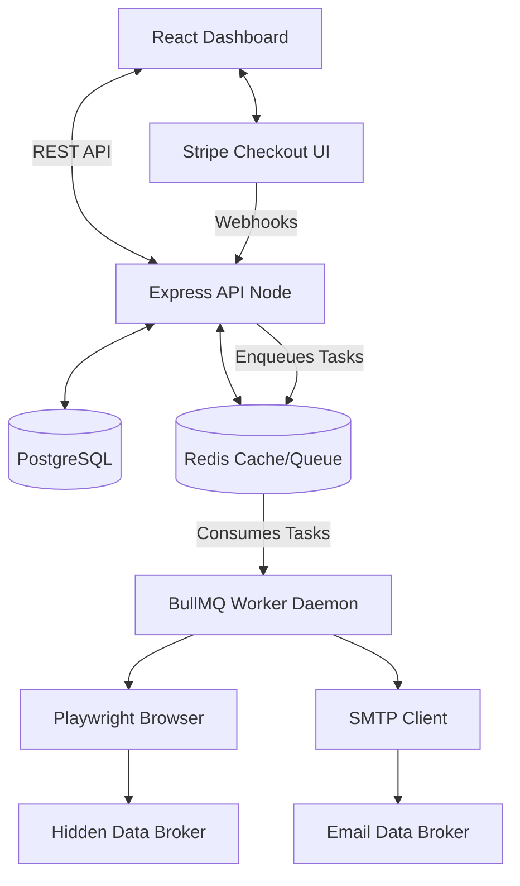
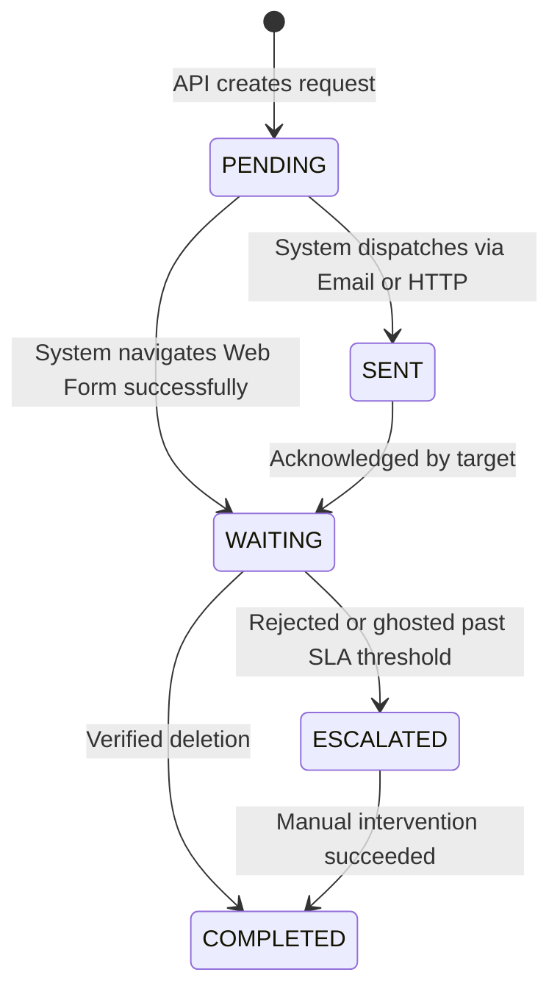

# Opaca Engine System Architecture

**Opaca Engine** is a heavily isolated, containerized monorepo split across three primary operational boundaries:
1.  **Client Environment:** A React Single Page Application (SPA) driven by Vite. End-users manipulate `Identities` and initiate Stripe Checkout subcriptions.
2.  **API Layer:** A Node.js/Express web server that handles synchronous commands (Authentication, Webhooks, CRUD).
3.  **Worker Plane:** A headless background daemon (BullMQ + Playwright) tasked with the heavy processing (Cron scheduling, DOM automation).

## 1. High-Level Diagram

## 2. Core Operational Entities

- **User**: The root authentication node tied to Stripe subscriptions.
- **Identity**: The encrypted sub-node storing the actual Personal Identifiable Information (PII) like names, ghost emails, and aliases that need removing.
- **Broker**: A target data aggregator with an associated extraction method ('WEB_FORM' or 'EMAIL'). Admin-configured schemas define how to manipulate their DOM payload.
- **Request (PrivacyRequest)**: The connective tissue linking an Identity to a Broker. This orchestrates the lifecycle matrix below.

## 3. Data Processing State Machine

When an identity is pushed against a broker, the resulting `PrivacyRequest` follows a strict temporal algorithm natively managed by BullMQ retries:

## 4. Recurring Scan Cron

Because brokers routinely repopulate data (scraping public records faster than they can be deleted), Opaca is built defensively using aggressive Cron intervals. The `cron.processor.js` evaluates all users with a `recurringSchedules` flag nightly. If an `intervalDay` is breached, a new block of `PrivacyRequests` is aggressively launched against all active brokers on behalf of the user's root `Identity`.

## 5. Security Enclaves

1. **RBAC Isolation:** All Broker manipulation definitions happen on the `/admin` boundary, which requires explicit `role: 'ADMIN'` Prisma enchaining.
2. **Double Encryption:** Identity footprints remain isolated behind User IDs, and can be deleted concurrently cascading over all associated requests.
3. **MFA Guards:** Standard TOTP MFA flows back all authentication layers, protecting the sensitive payload domains.
