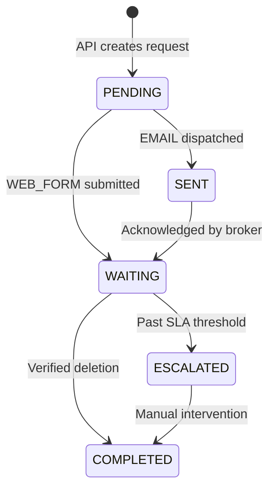

# Broker Integration Guidelines

This document explains how Opaca Engine models data brokers, how the automation engine dispatches privacy requests against them, and how to add support for a new broker.

## 1. Broker Data Model

Every broker is stored in the `brokers` table (see `server/prisma/schema.prisma`). The key fields are:

| Field | Purpose |
|---|---|
| `name` | Human-readable label, unique across the system |
| `website` | Broker's public homepage |
| `privacyUrl` | Direct link to the broker's privacy/opt-out page |
| `optOutUrl` | URL Playwright navigates to for `WEB_FORM` dispatches |
| `method` | Dispatch strategy — `EMAIL`, `WEB_FORM`, `API`, `CSV_EXPORT`, or `CUSTOM` |
| `formMapping` | Structured JSON describing CSS selectors and data keys for `WEB_FORM` automation (see §3) |
| `apiConfig` | JSON blob holding endpoint, auth type, and field mapping when `apiSupport` is `true` |
| `expectedResponseDays` | SLA window (default 30). After this many days a `WAITING` request is escalated |
| `status` | `ACTIVE`, `UNRESPONSIVE`, `DISABLED`, or `UNDER_REVIEW` |

Brokers are managed exclusively through the Admin panel (`/admin/brokers`) or the API at `POST /api/admin/brokers` and `PATCH /api/admin/brokers/:id`.

## 2. Dispatch Methods

### EMAIL

The system renders a Handlebars `RequestTemplate` (subject + body) against the user's identity data, then sends it via Nodemailer to the broker's `contactEmail`. The outbound `Message-ID` is stored on the `PrivacyRequest` for thread correlation.

### WEB_FORM

Playwright launches a headless Chromium instance, navigates to `optOutUrl`, and fills the form using either the **structured `formMapping`** (preferred) or a **heuristic fallback** that guesses common field selectors. On failure, a screenshot is captured and attached to the request.

### API / CSV_EXPORT / CUSTOM

Reserved for future use. When `apiSupport` is `true`, the dispatcher reads `apiConfig` for the endpoint, authentication method, and field mapping.

## 3. Structured Form Mapping

The `formMapping` JSON is the heart of `WEB_FORM` automation. It tells Playwright exactly which selectors to target and what identity data to fill. The schema is validated by `createBrokerSchema` in `server/src/schemas/admin.schemas.js`.

### Schema

```json
{
  "steps": [
    {
      "fields": [
        { "selector": "#first-name", "dataKey": "firstName" },
        { "selector": "#last-name",  "dataKey": "lastName" },
        { "selector": "#email",      "dataKey": "email" }
      ],
      "navigation": {
        "clickSelector": "button.next-step",
        "waitFor": "selector",
        "waitSelector": "#step-2"
      }
    },
    {
      "fields": [
        { "selector": "#address", "dataKey": "addressLine1" }
      ]
    }
  ],
  "submitSelector": "button[type='submit']",
  "confirmationSelector": ".success-message"
}
```

### Field Reference

Each field object contains:

| Key | Values | Description |
|---|---|---|
| `selector` | CSS selector | Target element on the page |
| `dataKey` | `firstName`, `lastName`, `email`, `phone`, `addressLine1`, `addressLine2`, `city`, `region`, `postalCode`, `country`, `fullName`, `birthYear`, `custom` | Which identity field to read |
| `action` | `fill` (default), `select`, `check`, `click` | Interaction type |
| `customValue` | string | Static value (only when `dataKey` is `custom`) |

### Navigation Steps

For multi-page forms, each step can include a `navigation` block:

| Key | Description |
|---|---|
| `clickSelector` | Element to click to advance |
| `waitFor` | `navigation`, `selector`, or `timeout` |
| `waitSelector` | Element to wait for after click (when `waitFor` is `selector`) |
| `waitTimeoutMs` | Max wait in ms (100–60 000) |

### Heuristic Fallback

If a broker has no `formMapping`, the dispatch processor falls back to `executeHeuristicFallback()`, which probes the DOM for common CSS selectors (e.g. `input[name="first_name"]`). This is fragile and should only be used for initial testing.

## 4. Adding a New Broker

1. **Admin UI** — Navigate to `/admin` → Brokers → Create. Fill in the name, website, opt-out URL, method, and (for `WEB_FORM`) the `formMapping` JSON.
2. **API** — `POST /api/admin/brokers` with a body matching `createBrokerSchema`.
3. **Seed Script** — For bulk bootstrapping, add broker objects to the seed data in `server/prisma/seed.js`.

After creation, any user's identity that triggers a privacy scan will automatically generate `PrivacyRequest` records against the new broker.

## 5. Request Lifecycle



Requests that fail during dispatch enter `RETRY` (up to `maxRetries`, default 3) or `FAILED`. Screenshots captured on failure are stored at `screenshotUrl` for debugging.

## 6. Environment Variables

| Variable | Default | Description |
|---|---|---|
| `PLAYWRIGHT_HEADLESS` | `true` | Run Chromium headless |
| `BROKER_JOB_CONCURRENCY` | `3` | Max parallel Playwright sessions |
| `BROKER_JOB_TIMEOUT_MS` | `45000` | Per-job timeout in milliseconds |
